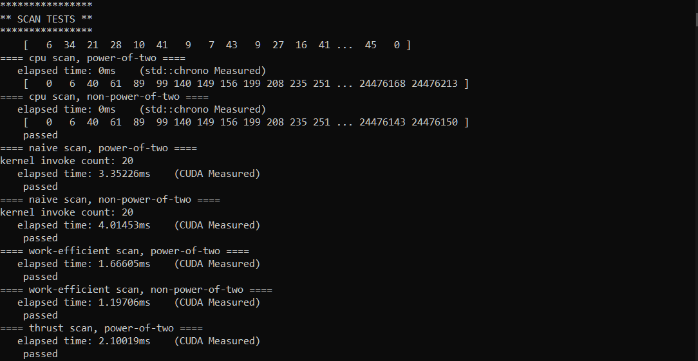
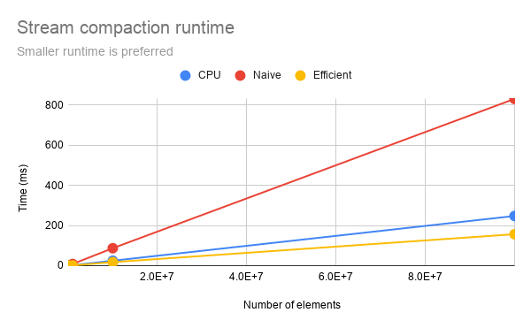

CUDA Stream Compaction
======================

**University of Pennsylvania, CIS 565: GPU Programming and Architecture, Project 2**

* Thy (Tea) Tran 
  * [LinkedIn](https://www.linkedin.com/in/thy-tran-97a30b148/), [personal website](https://tatran5.github.io/), [email](thytran316@outlook.com)
* Tested on: Windows 10, i7-8750H @ 2.20GHz 22GB, GTX 1070

# Scan, Stream Compaction and Radix Sort


The main goal of the project is to implement different methods for scan (mostly exclusive scan) and stream compaction. Scan is used to aid with stream compaction and radix sort. For scan and stream compaction, several CPU and GPU methods are implemented to compare their efficiency. 

## Performance Analysis

The runtime of the naive method on GPU is worst, followed by that of CPU, then GPU work-efficient method, and finally by thrust. 

Both the naive and work-efficient method on the GPU only rely on global memory instead of ultilizing shared memory, which potentially lead to much slower runtime than thrust method (and CPU for the naive method.) Naive and work-efficient methods also do not use up the potential of warp partitioning or memory coalescing, which are features that thrust may have to reduce its runtime. 


The same explanation above is applicable to the below as well. 



Another thing to note that greatly affects performance within GPU implementation for both naive and work-efficient methods, compared with CPU method, is that the GPU ones only work well for a power-of-2-elements array. If an input array is not a power of 2, the number of elements is increased to the nearest power of 2. Hence, in this case, the runtime for scan and stream compaction on GPU is not that much better than that on the CPU.


The below is an example of the results with 1000000 elements. Note that the CPU scan time is 0ms (which is not true) because the CPU timer is disabled here, so that the CPU timer for stream compaction that uses CPU scan does not stop the program from executing.

```

****************
** SCAN TESTS **
****************
    [   2  30  36   0  31  22  46  36  16   3  45  48  20 ...  37   0 ]
==== cpu scan, power-of-two ====
   elapsed time: 0ms    (std::chrono Measured)
    [   0   2  32  68  68  99 121 167 203 219 222 267 315 ... 24482173 24482210 ]
==== cpu scan, non-power-of-two ====
   elapsed time: 0ms    (std::chrono Measured)
    [   0   2  32  68  68  99 121 167 203 219 222 267 315 ... 24482069 24482112 ]
    passed
==== naive scan, power-of-two ====
kernel invoke count: 20
   elapsed time: 2.18784ms    (CUDA Measured)
    passed
==== naive scan, non-power-of-two ====
kernel invoke count: 20
   elapsed time: 2.35523ms    (CUDA Measured)
    passed
==== work-efficient scan, power-of-two ====
   elapsed time: 1.20525ms    (CUDA Measured)
    passed
==== work-efficient scan, non-power-of-two ====
   elapsed time: 1.19664ms    (CUDA Measured)
    passed
==== thrust scan, power-of-two ====
   elapsed time: 1.94966ms    (CUDA Measured)
    passed
==== thrust scan, non-power-of-two ====
   elapsed time: 1.9712ms    (CUDA Measured)
    passed

*****************************
** STREAM COMPACTION TESTS **
*****************************
    [   1   0   0   0   2   3   2   1   0   3   1   2   1 ...   0   0 ]
==== cpu compact without scan, power-of-two ====
   elapsed time: 2.3196ms    (std::chrono Measured)
    [   1   2   3   2   1   3   1   2   1   3   1   2   2 ...   2   2 ]
    passed
==== cpu compact without scan, non-power-of-two ====
   elapsed time: 2.3835ms    (std::chrono Measured)
    [   1   2   3   2   1   3   1   2   1   3   1   2   2 ...   2   2 ]
    passed
==== cpu compact with scan ====
   elapsed time: 8.1008ms    (std::chrono Measured)
    [   1   2   3   2   1   3   1   2   1   3   1   2   2 ...   2   2 ]
    passed
==== work-efficient compact, power-of-two ====
   elapsed time: 1.1991ms    (CUDA Measured)
    passed
==== work-efficient compact, non-power-of-two ====
   elapsed time: 1.19808ms    (CUDA Measured)
    passed

*****************************
** RADIX SORT TESTS **
*****************************
    [   5  10  32  46  46  31   8   9  28  23  47  42  41 ...   8   0 ]
largest number of bits: 6
Correctly sorted:
    [   0   0   0   0   0   0   0   0   0   0   0   0   0 ...  49  49 ]
Yours:
    [   0   0   0   0   0   0   0   0   0   0   0   0   0 ...  49  49 ]
    passed
Press any key to continue . . .

```